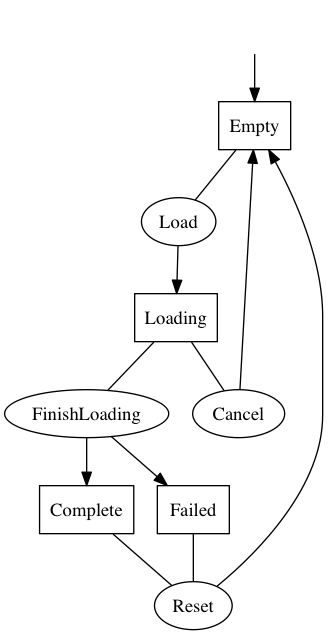

EFStateMachine.swift
====================

[](https://developer.apple.com/swift/)
[](https://raw.githubusercontent.com/Egeniq/EFStateMachine/master/LICENSE)
[](http://cocoapods.org)
[](https://github.com/Carthage/Carthage)

__A Simple State Machine in Swift__

FIXME: OUTDATED

Highlights of this state machine:

* uses enums for states
* support for associate types in state enums
* runs callback handler on state changes

This state machine is typically setup with an enum for its possible states, and an enum for its actions. The state
of the machine determines wether an action is allowed to run.

It is also possible to register a handler that get run when a state changes occur.

## Requirements

You need at least iOS 8.0 or Mac OS X 10.9.

This implementation is written using Swift 2.0. Use version 0.1.5 if you still need support for Swift 1.2. 

## Documentation

The API is fully documented in the source. See also the [example](#example) below.

## Installation

To install using CocoaPods, add to your Podfile:

    pod 'EFStateMachine', '~> 0.3'

To install using Carthage, add to your Cartfile:

    github "Egeniq/EFStateMachine" ~> 0.3

Or you just compile the source and add the `StateMachine.framework` to your own project.

## Example

Say you want to create the state machine to capture the flow in this diagram:



First, create an `enum` to hold the states.

```swift
enum State {
    case Empty
    case Loading(loadingMore: Bool)
    case Loaded(hasMore: Bool, offset: Int, updated: NSDate)
}
```

Now that we have both the states and actions declared, we can create the machine and give it its initial state.

```swift
let machine = StateMachine(initialState: State.Empty) { old, new in
    switch (old, new) {
    // Load
    case (.Empty, .Loading(let loadingMore)):
        return !loadingMore
    // Finish loading
    case (.Loading, .Loaded):
        return true
    // Refresh/Load More
    case (.Loaded(let hasMore, _, _), .Loading(let loadingMore)):
        return !loadingMore || (hasMore && loadingMore)
    default:
        return false
    }
}
```

For each action, register a handler to run. The handler will only be run if the current state of the state machine is one of those listed in `fromStates`. The handler must return a state, which will become the new state of the state machine.

```swift


func load() {
    if machine.changeToState(.Loading(loadingMore: false)) {
        // Load items
        itemService.loadItems(offset: 0) { result, hasMore, offset in
            items = result
            machine.changeToState(.Loaded(hasMore: hasMore, offset: offset, updated: NSDate()))
        }
    }
}

func refresh() {
    if machine.changeToState(.Loading(loadingMore: false)) {
        // Reset
        items.removeAll()

        // Load items
        itemService.loadItems(offset: 0) { result, hasMore, offset in
            items = result
            machine.changeToState(.Loaded(hasMore: hasMore, offset: offset, updated: NSDate()))
        }
    }
}

func loadMore() {
    guard case let State.Loaded(_, offset, _) = machine.state else { return }

    if machine.changeToState(.Loading(loadingMore: true)) {
        // Load more items
        itemService.loadItems(offset: offset) { result, hasMore, offset in
            items.appendContentsOf(result)
            machine.changeToState(.Loaded(hasMore: hasMore, offset: offset, updated: NSDate()))
        }
    }
}
```

You can also observe state changes and act upon such events. This is also a good moment to point out that you should be careful not to introduce retain loops. If `self` holds the state machine, you should use `[unowned self` or `[weak self]` with your handler.

```swift
machine.onChange = { [unowned self] old, new in
    switch new {
    case .Empty:
        self.statusLabel.text = "Hello!"
    case .Loading:
        self.statusLabel.text = "Loading"
    case .Loaded(_, _, let updated):
        self.statusLabel.text = "Last updated \(updated)"
    }
}
```

Now your state machine is ready to be used.

```swift
load()
refresh()
loadMore()
```	
